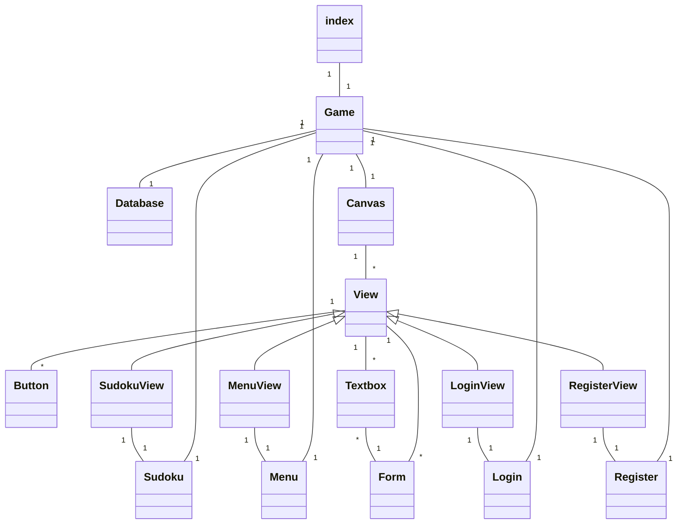
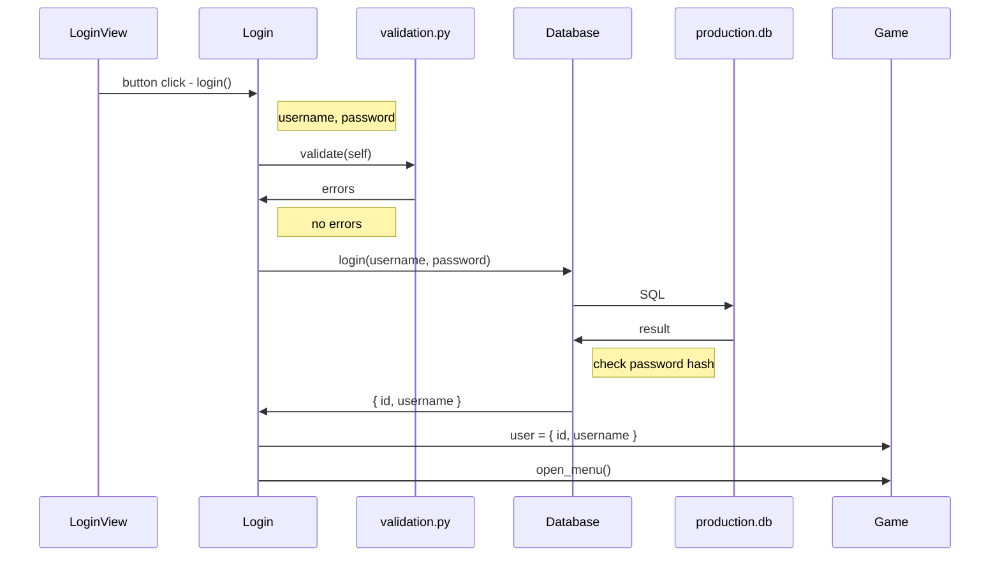

# Arkkitehtuurikuvaus

## Rakenne

Ohjelman lähdekoodi on `src` kansiossa. `src/index.py` on ohjelman käynnistyskohta.

`src/index.py` alustaa ohjelman muuttujat, ja luo `src/game.py`:n `Game` -luokan. `Game` hallitsee ohjelman tilaa ja on keskeisin luokka koko ohjelmassa.

`Game` käyttää `src/services` kansion luokkia (palveluita) ohjelman toiminnallisuuden toteutukseen.

`Game` käyttää `/ui/canvas.py`:n `Canvas` luokkaa käyttöliittymän tilan hallintaan.  
`src/ui` kansiossa on kaikki luokat, jotka liittyvät käyttöliittymän toteutukseen.  
`src/ui/components` sisältää käyttöliittymäelementtiluokkia (nappeja, laatikoita yms.), joilla toteutetaan itse käyttöliittymä.  
`src/ui/views` sisältää jokaiselle palvelulle oman käyttöliittymänäkymä -luokan.

`src/tests` sisältää ohjelman testit.

`src/utils` sisältää funktioita, joita käytetään ympäri ohjelmaa.

## Sovelluslogiikka

Ohjelman tilaa hallitsee `game.py`:n `Game` luokka. Se käyttä toiminnallisuuden toteutukseen `src/services` kansion luokkia (palveluita). Jokaiselle käyttöliittymäluokalle (näkymälle) on oma palvelunsa. Myös tietokannalle on oma palvelu `db.py`.

Luokat tarjoavat käyttöliittymän toiminnoille funktioita (esim. `move_right()`, `open_sudoku()` ja `login()`) ja ne pitävät yllä sovelluksen toiminnalle keskeisiä muuttujia.

`db.py`:n luokka `Database` sisältää funktioita, joilla pystytää hakemaan ja lisäämään dataa paikalliseen tietokantaan.

## Käyttöliittymä

Sovellus sisältää neljä eri käyttöliittymänäkymää:

- Päävalikko
- Kirjautuminen
- Rekisteröityminen
- Sudoku

Jokaiselle näistä on oma sovelluslogiikkaluokka (palvelu) `src/services` kansiossa ja käyttöliittymäluokka (näkymä) `src/ui/views` kansiossa.

Tämä erottelu on tehty eristääkseen käyttöliittymäkoodi sovelluslogiikkakoodista testauksen helpomman/mahdollisen toteutuksen takia.

Jokainen näkymä saa sen konstruktorissa argumentikseen kyseisen palvelun, ja kutsuu palvelun funktioita ja lukee sen muuttujia.

`Game` luokka hallitsee käyttöliittymää `Canvas` luokan kautta. `Canvas` pitää kirjaa tämänhetkisestä näkymästä ja ohjaa käyttöliittymän piirtokutsut näkymälle. `Canvas` myös käsittelee käyttöliittymän tapahtumat ja kutsuu elementtien (nappien) kautta näkymien tapahtumia.

Kaikki käyttöliittymäluokat periytyvät `View` luokasta.

Käyttöliittymä on rakennettu siten, että peli-ikkunan kokoa voi muuttaa.

## Sudoku -sovelluksen luokkakaavio

## Tietojen pysyväistallennus

Ohjelma tallentaa rekisteröityneitä käyttäjiä ja heidän suoritettujen Sudokujen tiedot paikalliseen SQLite tietokantaan.

Tietokannat ja niiden .sql skriptit sijaitsevat `/database` kansiossa.

`src/services/db.py` toteuttaa tietokannan käsittelyyn liittyvän luokan `Database`.

Käyttäjien salasanat tallennetaan `werkzeug.security` -kirjaston tarjoamien funktioiden muodossa (SHA256).

### Monta tietokantaa

Käytössä on kolme eri tietokantaa:

- production.sql
- development.sql
- tests.sql

`production.sql` tietokantaa käytetään kun ohjelma käynnistetään komennolla `poetry run invoke start`, ja sen tiedot säilytetään normaalisti.

`development.sql` tietokantaa käytetään kun ohjelma käynnistetään komennolla `poetry run invoke dev`, ja sen tiedot pyyhitään ja alustetaan `/database/sample.sql`:n mukaisilla mallitiedoilla aina sovelluksen käynnistyessä.

`tests.sql` tietokantaa käytetään testien yhteydessä.

## Päätoiminnallisuudet

Ohjelma käynnistyy `index.py`:n alustamana ja se jää pyörimään `Game` luokan pelisilmukkaan. `Game` luokka alustaa `Menu` palvelun ja ohjaa `Canvas` luokan määrittää näkymä.

Ohjelmalla pystyy valitsemaan `MenuView`:n määrittelemästä päävalikosta, minkä Sudokun haluaa ratkaista. Käyttäjä valitsee Sudokun ratkaistavaksi, jolloin `Game` päivittää palvelun `Sudoku` luokkaan. `Canvas` päivittää näkymäksi `SudokuView`.

Ohjelmalla pystyy pelaamaan Sudoku -peliä ja se tarkistaa automaattisesti onko Sudoku ratkaistu.

Käyttäjä pystyy myös kirjautumaan sisään tai luomaan uuden käyttäjän päävalikon ylhäällä olevasta napista `Login`.

Käyttäjä tekee ensin uuden käyttäjän rekisteröintinäkymästä, jonne pääsee kirjautumisnäkymän napista `New user?`.

Ohjelmaa kirjaa käyttäjän automaattisesti sisään uuden käyttäjän rekisteröinnin yhteydessä.

### Sekvenssikaavio onnistuneesta kirjautumisesta

Tässä on kaavio normaalista kirjautumistapahtumasta kirjautumisnäkymästä.

## Ohjelman rakenteeseen jääneet heikkoudet

### Käyttöliittymä

Käyttöliittymä on toteutettu puhtaasti pygamen tarjoamilla ominaisuuksilla.  
Toisaalta tämä on siistiä, koska ohjelmassa on vähemmän riippuvuuksia.  
Toisaalta tämä on tuskallista jatkokehityksen kannalta: uusien elementtien luominen vie paljon aikaa, ja uusien näkymien tekeminen on hyvin tarkkaa sekä hieman haastavaa tämänhetkisillä elementeillä.
