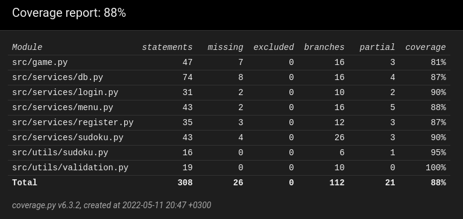

# Testausdokumentti

Ohjelmaa on testattu manuaalisesti Linux -ympäristössä kehityksen aikana, sekä automatisoiduilla yksikkö- ja integraatiotesteillä.

## Yksikkö- ja integraatiotestaus

### Sovelluslogiikan yksikkötestaus

`src/services` kansiossa olevat sovelluslogiikan toteuttavat palveluluokat testataan erikseen niiden tiedostojen nimiä vastaavissa testaustiedostoissa (esim. `sudoku.py` -> `sudoku_test.py`). Joidenkin luokkien testauksessa injektoidaan `Fake-` luokkia, joiden funktioita ja muuttujia sovelluslogiikan tiedostot käyttävät.

### `Game` -luokan integraatiotestaus

Ohjelman integraatiotestaus toteutetaan `game_test.py` tiedostossa. Testeissä simuloidaan käyttöliittymän tapahtumia kutsumalla sovelluslogiikan toteuttavien luokkien metodeja.

Integraatiotesteissä testataan sovelluksen päätoiminnallisuudet:

- Tapahtumien käsittely
- Päävalikon käyttö
- Sudokun ratkaisu
- Käyttäjän rekisteröinti
- Käyttäjän kirjautuminen
- Käyttäjän uloskirjautuminen

### Utils yksikkötestaus

`src/utils` sisältää näppäriä koodinpätkiä, joita voidaan käyttää missä tahansa sovellusta. `validation.py` on ainoa tiedosto, jonka funktioita testataan erikseen `validation_test.py` testeissä erinäisillä syötteillä.

### Testauskattavuus

Sovelluksen testauksen haarautumiskattavuus on 88% lukuunottamatta käyttöliittymää ja `index.py` tiedostoa.

## Järjestelmätestaus

Sovelluksen järjestelmätestaus on suoritettu manuaalisesti

### Asennus

Sovellus on testattu sen [käyttöohjeen](kayttoohje.md) kuvaamalla tavalla Linux -ympäristössä.

Sovellusta on myös testattu jos `sudokus/` kansio on tyhjä.

### Toiminnallisuudet

[Määrittelydokumentin](vaatimusmaarittely.md) listaamat toiminnallisuudet on testattu. Lomakkeita on myös testattu tyhmillä syötteillä, kuten tyhjillä syötekentillä.
