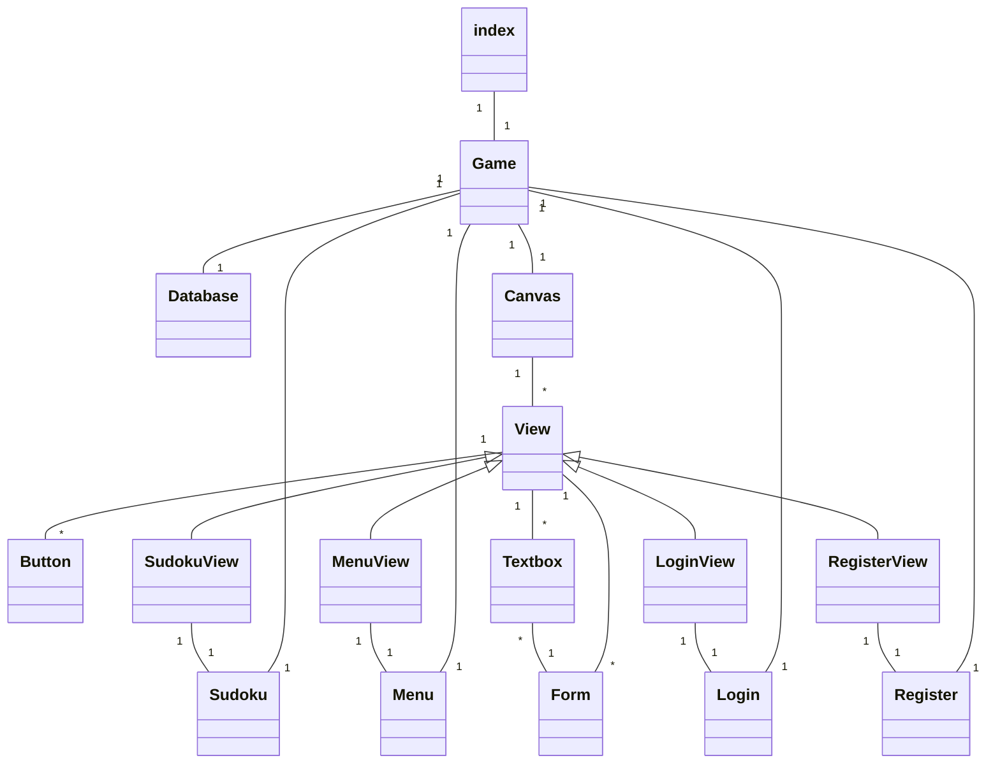
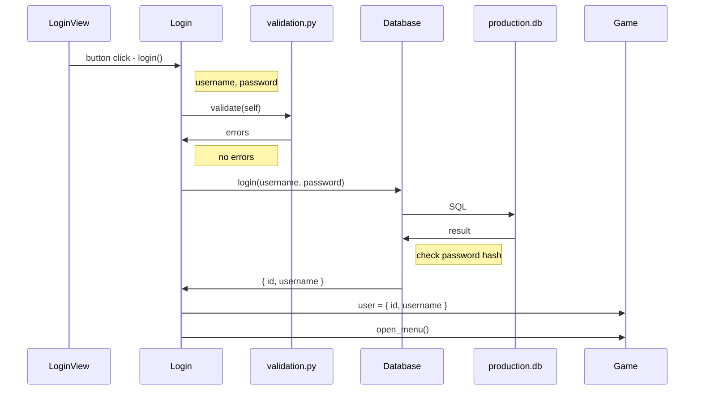

## Sudoku -sovelluksen luokkakaavio

```mermaid
classDiagram
index "1" -- "1" Game
Game "1" -- "1" Sudoku
Game "1" -- "1" Menu
Game "1" -- "1" Login
Game "1" -- "1" Register
Game "1" -- "1" Database
Game "1" -- "1" Canvas
Canvas "1" -- "*" View
View "1" -- "*" Button
View "1" -- "*" Textbox
View "1" -- "*" Form
Textbox "*" -- "1" Form
View <|-- SudokuView
SudokuView "1" -- "1" Sudoku
View <|-- MenuView
MenuView "1" -- "1" Menu
View <|-- LoginView
LoginView "1" -- "1" Login
View <|-- RegisterView
RegisterView "1" -- "1" Register

class index { }
class Game { }
class Canvas { }
class Button { }
class Textbox { }
class Form { }
class View { }

class SudokuView { }
class MenuView { }
class LoginView { }
class RegisterView { }

class Sudoku { }
class Menu { }
class Login { }
class Register { }
class Database { }
```

## Sekvenssikaavio kirjautumisesta

```mermaid
sequenceDiagram
participant LoginView
participant Login
participant validation.py
participant Database
participant production.db
participant Game

LoginView ->> Login: button click - login()
note right of Login: username, password
Login ->> validation.py: validate(self)
validation.py ->> Login: errors
note right of Login: no errors
Login ->> Database: login(username, password)
Database ->> production.db: SQL
production.db ->> Database: result
note right of Database: check password hash
Database ->> Login: { id, username }
Login ->> Game: user = { id, username }
Login ->> Game: open_menu()

```

> Written with [StackEdit](https://stackedit.io/).
