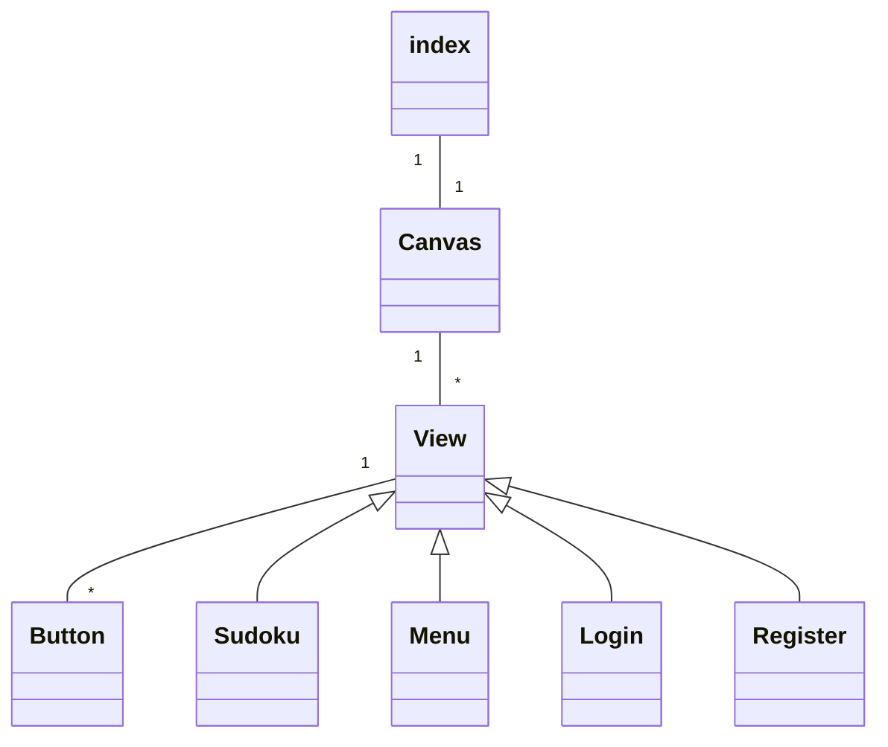

Sudoku -sovelluksen luokkakaavio

```mermaid
classDiagram
index "1" -- "1" Canvas
Canvas "1" -- "*" View
View "1" -- "*" Button
View <|-- Sudoku
View <|-- Menu
View <|-- Login
View <|-- Register

class index { }
class Canvas { }
class Button { }
class View { }

class Sudoku { }
class Menu { }
class Login { }
class Register { }
```

> Written with [StackEdit](https://stackedit.io/).
