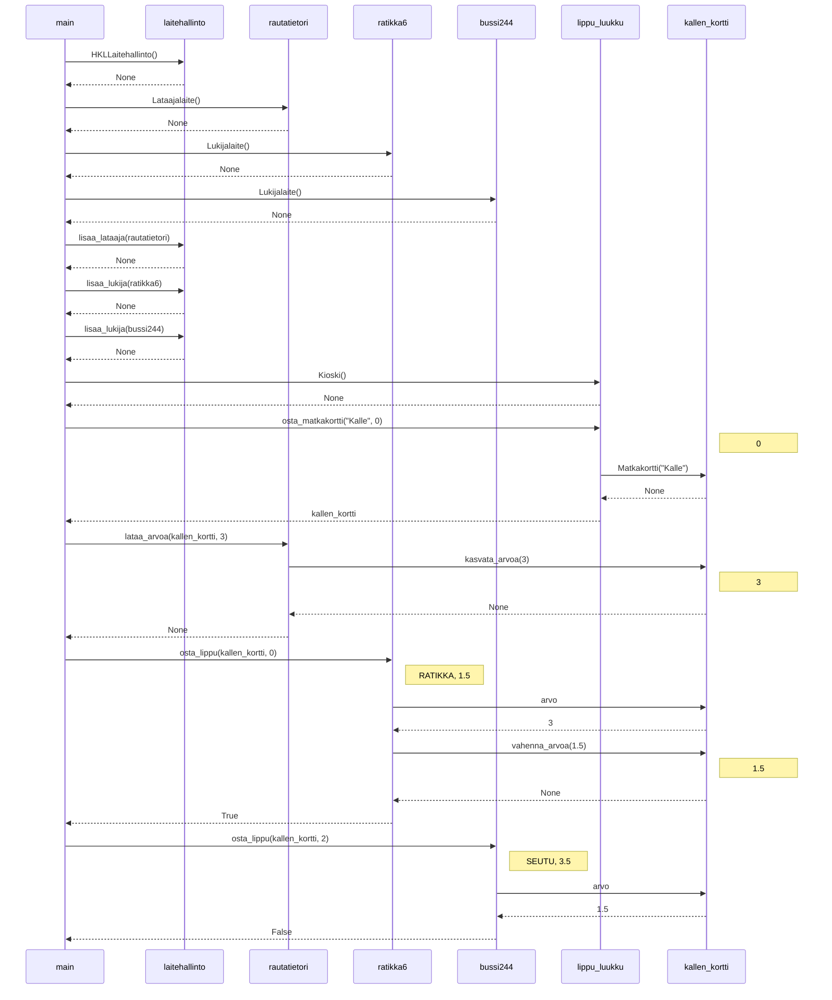

## Tehtävä 4: Laajempi sekvenssikaavio

Tarkastellaan HSL-matkakorttien hallintaan käytettävää koodia.

```mermaid
	sequenceDiagram
	participant main
	participant laitehallinto
	main->>laitehallinto: HKLLaitehallinto()
	laitehallinto-->>main: None
	
	participant rautatietori
	main->>rautatietori: Lataajalaite()
	rautatietori-->>main: None

	participant ratikka6
	main->>ratikka6: Lukijalaite()
	ratikka6-->>main: None
	
	participant bussi244
	main->>bussi244: Lukijalaite()
	bussi244-->>main: None

	main->>laitehallinto: lisaa_lataaja(rautatietori)
	laitehallinto-->>main: None
	main->>laitehallinto: lisaa_lukija(ratikka6)
	laitehallinto-->>main: None
	main->>laitehallinto: lisaa_lukija(bussi244)
	laitehallinto-->>main: None

	participant lippu_luukku
	main->>lippu_luukku: Kioski()
	lippu_luukku-->>main: None

	participant kallen_kortti
	main->>lippu_luukku: osta_matkakortti("Kalle", 0)
	Note right of kallen_kortti: 0
	lippu_luukku->>kallen_kortti: Matkakortti("Kalle")
	kallen_kortti-->>lippu_luukku: None
	lippu_luukku-->>main: kallen_kortti

	main->>rautatietori: lataa_arvoa(kallen_kortti, 3)
	rautatietori->>kallen_kortti: kasvata_arvoa(3)
	Note right of kallen_kortti: 3
	kallen_kortti-->>rautatietori: None
	rautatietori-->>main: None

	main->>ratikka6: osta_lippu(kallen_kortti, 0)
	Note right of ratikka6: RATIKKA, 1.5
	ratikka6->>kallen_kortti: arvo
	kallen_kortti-->>ratikka6: 3
	ratikka6->>kallen_kortti: vahenna_arvoa(1.5)
	Note right of kallen_kortti: 1.5
	kallen_kortti-->>ratikka6: None
	ratikka6-->>main: True

	main->>bussi244: osta_lippu(kallen_kortti, 2)
	Note right of bussi244: SEUTU, 3.5
	bussi244->>kallen_kortti: arvo
	kallen_kortti-->>bussi244: 1.5
	bussi244-->>main: False
```

> Written with [StackEdit](https://stackedit.io/).
