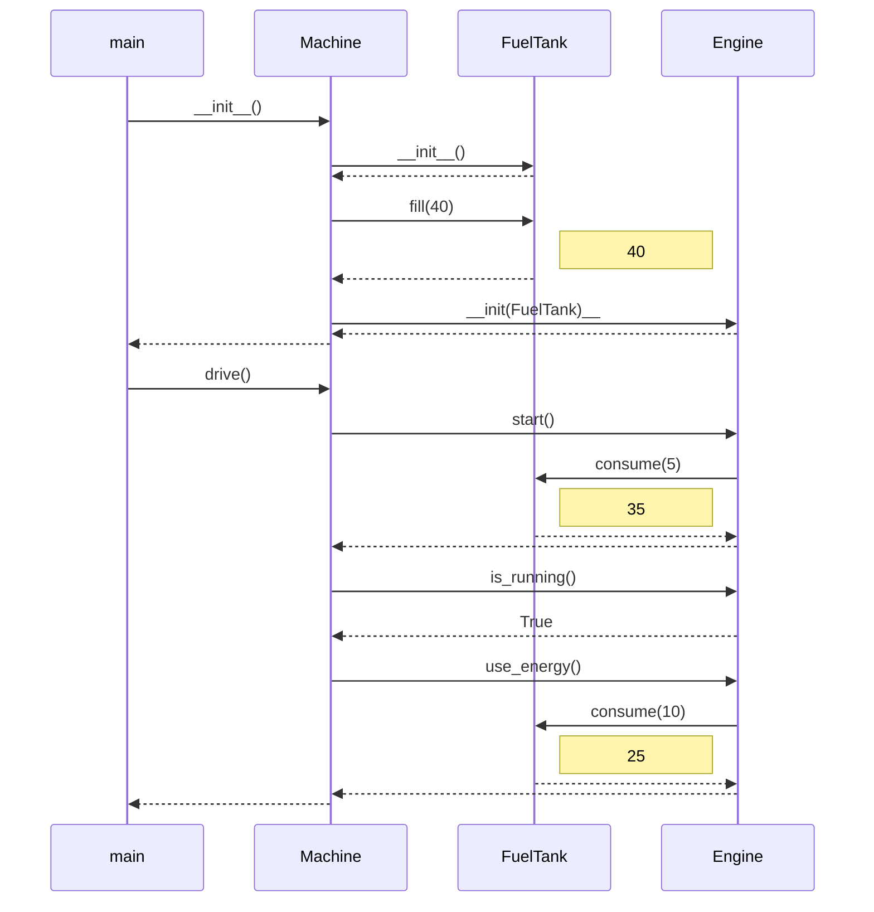

## Tehtävä 3: Sekvenssikaavio

Tarkastellaan bensatankista ja moottorista koostuvan koneen Python-koodia.

```mermaid
sequenceDiagram
	participant main
	participant Machine
	participant FuelTank
	participant Engine
	main->>Machine: __init__()
	Machine->>FuelTank: __init__()
	FuelTank-->>Machine:
	Machine->>FuelTank: fill(40)
	Note right of FuelTank: 40
	FuelTank-->>Machine:
	Machine->>Engine: __init(FuelTank)__
	Engine-->>Machine:
	Machine-->>main:
	main->>Machine: drive()
	Machine->>Engine: start()
	Engine->>FuelTank: consume(5)
	Note right of FuelTank: 35
	FuelTank-->>Engine:
	Engine-->>Machine:
	Machine->>Engine: is_running()
	Engine-->>Machine: True
	Machine->>Engine: use_energy()
	Engine->>FuelTank: consume(10)
	Note right of FuelTank: 25
	FuelTank-->>Engine:
	Engine-->>Machine:
	Machine-->>main:
```

> Written with [StackEdit](https://stackedit.io/).
